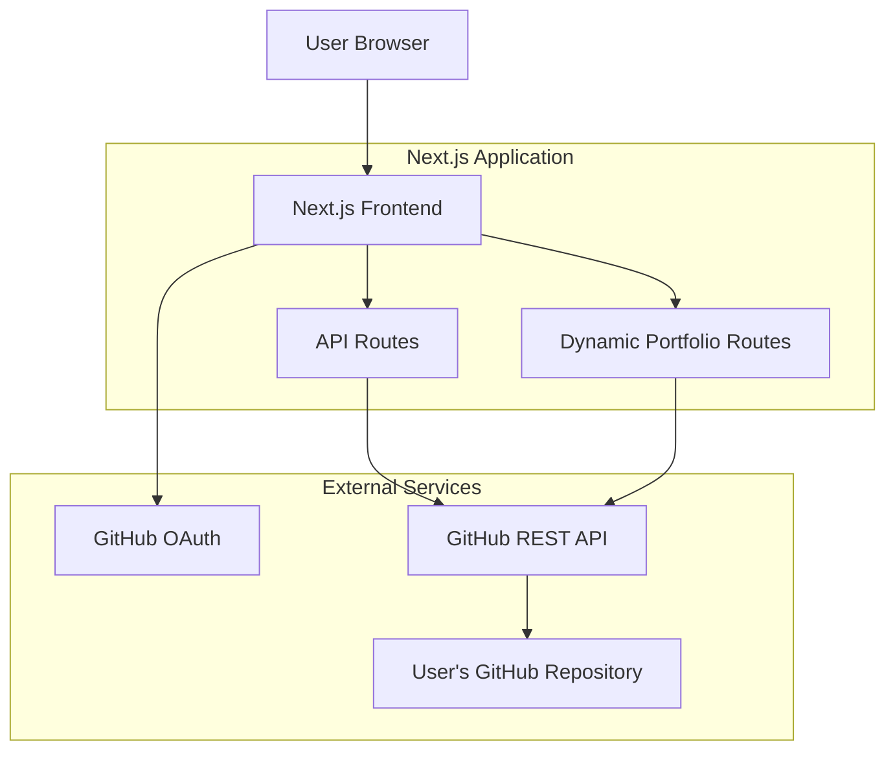
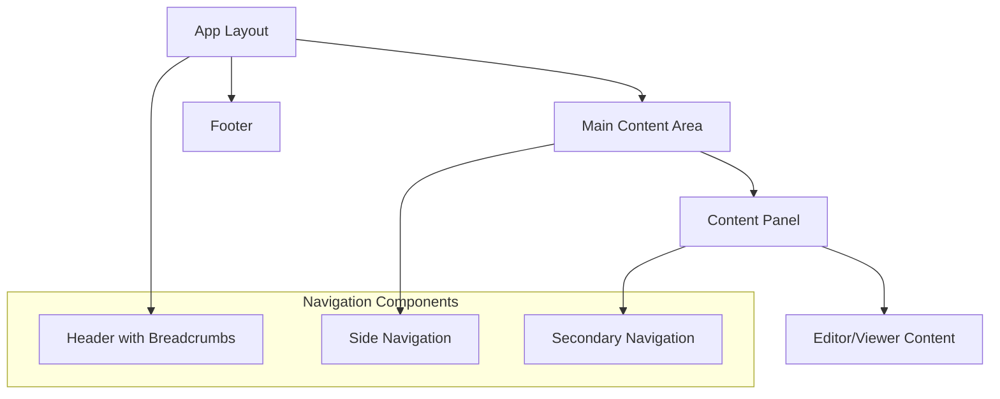

# Design Document

## Overview

The decentralized portfolio platform is a Next.js application that enables users to fork GitHub repository templates, edit them through a web interface, and host them dynamically at URLs that directly map to their GitHub repositories. The platform maintains complete user sovereignty over code and data while providing an intuitive editing experience.

The system architecture follows a serverless approach using Next.js API routes for GitHub integration and dynamic routing for portfolio rendering. All user data remains in their GitHub repositories, ensuring true decentralization.

## Architecture

### High-Level Architecture



### Core Components

1. **Authentication Layer**: GitHub OAuth integration for secure repository access
2. **Template Gallery**: Interface for browsing and selecting portfolio templates
3. **Repository Manager**: Handles forking, content analysis, and synchronization
4. **Web Editor**: Rich editing interface for portfolio content
5. **Dynamic Renderer**: Server-side rendering of portfolios from GitHub repositories
6. **API Layer**: Next.js API routes for GitHub operations

## Components and Interfaces

### 1. GitHub Authentication Service

**Purpose**: Manages GitHub OAuth flow and token storage

**Key Methods**:
```javascript
class GitHubAuthService {
  async initiateOAuth(redirectUri)
  async handleCallback(code, state)
  async refreshToken(refreshToken)
  async validateToken(accessToken)
}
```

**GitHub OAuth Configuration**:
- Scopes: `public_repo`, `repo` (for private repository access if needed)
- Redirect URI: `/api/auth/github/callback`
- Token storage: Secure HTTP-only cookies or session storage

### 2. Repository Service

**Purpose**: Handles all GitHub repository operations

**Key Methods**:
```javascript
class RepositoryService {
  // Forking operations
  async forkRepository(templateOwner, templateRepo, accessToken)
  async verifyFork(owner, repo, accessToken)
  
  // Content operations
  async getRepositoryStructure(owner, repo, accessToken)
  async getFileContent(owner, repo, path, accessToken)
  async updateFileContent(owner, repo, path, content, message, accessToken)
  async createCommit(owner, repo, changes, message, accessToken)
  
  // Synchronization
  async getLatestCommit(owner, repo, accessToken)
  async checkForUpdates(owner, repo, lastKnownSha, accessToken)
}
```

**GitHub REST API Endpoints Used**:
- `POST /repos/{template_owner}/{template_repo}/forks` - Fork repository
- `GET /repos/{owner}/{repo}` - Get repository information
- `GET /repos/{owner}/{repo}/contents/{path}` - Get file contents
- `PUT /repos/{owner}/{repo}/contents/{path}` - Update file contents
- `GET /repos/{owner}/{repo}/commits` - Get commit history

### 3. Template Analysis Service

**Purpose**: Analyzes repository structure using explicit conventions to determine editing capabilities

**Template Convention Requirements**:
Templates must include a `.nebula/config.json` file that defines the editing schema:

```javascript
// .nebula/config.json - Required configuration file
{
  "version": "1.0",
  "templateType": "json" | "markdown" | "hybrid",
  "contentFiles": [
    {
      "path": "data.json",
      "type": "json",
      "schema": {
        "title": { "type": "string", "label": "Portfolio Title", "required": true },
        "description": { "type": "text", "label": "Description", "maxLength": 500 },
        "sections": {
          "type": "array",
          "items": {
            "title": { "type": "string", "label": "Section Title" },
            "content": { "type": "markdown", "label": "Section Content" }
          }
        }
      }
    }
  ],
  "previewComponent": "PortfolioTemplate",
  "editableFields": ["title", "description", "sections"],
  "assets": {
    "allowedTypes": ["image/jpeg", "image/png", "image/webp"],
    "maxSize": "5MB",
    "paths": ["public/images", "assets"]
  }
}
```

**Key Methods**:
```javascript
class TemplateAnalysisService {
  async analyzeStructure(repositoryContents) {
    // 1. Look for .nebula/config.json
    const configFile = repositoryContents.find(f => f.path === '.nebula/config.json');
    if (!configFile) {
      throw new Error('Template missing required .nebula/config.json');
    }
    
    // 2. Parse and validate configuration
    const config = JSON.parse(configFile.content);
    this.validateConfig(config);
    
    return config;
  }
  
  async identifyContentFiles(config) {
    // Use explicit contentFiles from config
    return config.contentFiles.map(file => ({
      path: file.path,
      type: file.type,
      schema: file.schema,
      editable: true
    }));
  }
  
  async generateEditingSchema(contentFiles) {
    // Convert schema definitions to form fields
    return contentFiles.map(file => ({
      file: file.path,
      fields: this.schemaToFormFields(file.schema)
    }));
  }
  
  schemaToFormFields(schema) {
    const fields = [];
    
    for (const [key, definition] of Object.entries(schema)) {
      fields.push({
        name: key,
        type: definition.type, // 'string', 'text', 'markdown', 'array', etc.
        label: definition.label || key,
        required: definition.required || false,
        validation: {
          maxLength: definition.maxLength,
          pattern: definition.pattern,
          min: definition.min,
          max: definition.max
        },
        // For array types
        items: definition.items ? this.schemaToFormFields(definition.items) : null
      });
    }
    
    return fields;
  }
  
  validateConfig(config) {
    const requiredFields = ['version', 'templateType', 'contentFiles'];
    for (const field of requiredFields) {
      if (!config[field]) {
        throw new Error(`Template config missing required field: ${field}`);
      }
    }
    
    // Validate schema definitions
    for (const contentFile of config.contentFiles) {
      if (!contentFile.path || !contentFile.schema) {
        throw new Error('Content file missing path or schema');
      }
    }
  }
}
```

**Supported Template Structures**:

1. **JSON-based Template**:
```
portfolio-template/
├── .nebula/
│   └── config.json          # Editing schema definition
├── data.json               # Main content file
├── components/
│   └── PortfolioTemplate.js # React component
└── public/
    └── images/             # Asset directory
```

2. **Markdown-based Template**:
```
blog-template/
├── .nebula/
│   └── config.json         # Defines markdown file schemas
├── content/
│   ├── about.md           # Individual content files
│   ├── projects.md
│   └── contact.md
├── components/
│   └── BlogTemplate.js
└── public/
```

3. **Hybrid Template**:
```
hybrid-template/
├── .nebula/
│   └── config.json         # Mixed content definitions
├── config.json            # Site configuration
├── content/
│   └── posts/             # Markdown content
└── components/
```

**Schema Type Definitions**:
```javascript
const supportedSchemaTypes = {
  'string': { component: 'TextInput', validation: ['required', 'maxLength'] },
  'text': { component: 'TextArea', validation: ['required', 'maxLength'] },
  'markdown': { component: 'MarkdownEditor', validation: ['required'] },
  'number': { component: 'NumberInput', validation: ['required', 'min', 'max'] },
  'boolean': { component: 'Checkbox', validation: [] },
  'select': { component: 'Select', validation: ['required', 'options'] },
  'array': { component: 'ArrayEditor', validation: ['minItems', 'maxItems'] },
  'object': { component: 'ObjectEditor', validation: ['required'] },
  'image': { component: 'ImageUpload', validation: ['required', 'fileSize', 'fileType'] }
};
```

### 4. Web Editor Interface

**Purpose**: Provides intuitive editing interface for portfolio content

**Components**:
- `EditorLayout`: Main editor container with side navigation and breadcrumbs
- `SideNavbar`: Collapsible side menu with file tree and quick actions
- `Breadcrumbs`: Navigation trail showing current location and context
- `SecondaryNavigation`: Tab-based navigation for different editing modes
- `ContentEditor`: Rich text/markdown editor for content
- `MediaManager`: Image and asset upload/management
- `PreviewPane`: Live preview of changes
- `SaveManager`: Handles saving and conflict resolution

**Navigation Structure**:
```javascript
const navigationStructure = {
  sideNavbar: {
    sections: [
      {
        title: 'Repository',
        items: [
          { label: 'Overview', icon: 'home', path: '/editor' },
          { label: 'Files', icon: 'folder', path: '/editor/files' },
          { label: 'Settings', icon: 'settings', path: '/editor/settings' }
        ]
      },
      {
        title: 'Content',
        items: [
          { label: 'Pages', icon: 'document', path: '/editor/pages' },
          { label: 'Media', icon: 'image', path: '/editor/media' },
          { label: 'Data', icon: 'database', path: '/editor/data' }
        ]
      },
      {
        title: 'Tools',
        items: [
          { label: 'Preview', icon: 'eye', path: '/editor/preview' },
          { label: 'Deploy', icon: 'rocket', path: '/editor/deploy' },
          { label: 'History', icon: 'clock', path: '/editor/history' }
        ]
      }
    ]
  },
  
  breadcrumbs: {
    format: 'Home > {username} > {repository} > {section} > {subsection}',
    examples: [
      'Home > johndoe > my-portfolio > Pages > About',
      'Home > johndoe > my-portfolio > Media > Images',
      'Home > johndoe > my-portfolio > Settings > General'
    ]
  },
  
  secondaryNavigation: {
    contextual: true,
    tabs: {
      editor: ['Edit', 'Preview', 'Settings'],
      files: ['Tree View', 'List View', 'Search'],
      media: ['Gallery', 'Upload', 'Organize']
    }
  }
}

**State Management**:
```javascript
const editorState = {
  repository: { owner, name, structure },
  content: { files, currentFile, unsavedChanges },
  sync: { lastSync, hasConflicts, remoteChanges },
  navigation: {
    sidebarCollapsed: false,
    currentPath: '/editor/pages',
    breadcrumbs: [
      { label: 'Home', path: '/' },
      { label: 'johndoe', path: '/user/johndoe' },
      { label: 'my-portfolio', path: '/editor/johndoe/my-portfolio' },
      { label: 'Pages', path: '/editor/johndoe/my-portfolio/pages' }
    ],
    activeSecondaryTab: 'edit',
    recentFiles: []
  },
  ui: { activeTab, previewMode, loading }
}
```

### 5. UI/UX Components

**Purpose**: Provides consistent navigation and user experience across the platform

**Side Navigation Component**:
```javascript
const SideNavbar = {
  props: {
    isCollapsed: boolean,
    currentPath: string,
    repository: RepositoryInfo,
    onNavigate: (path: string) => void
  },
  
  features: [
    'Collapsible/expandable sidebar',
    'Repository context display',
    'File tree navigation',
    'Quick action buttons',
    'Search functionality',
    'Recent files list'
  ]
}
```

**Breadcrumb Component**:
```javascript
const Breadcrumbs = {
  props: {
    path: BreadcrumbItem[],
    separator: string,
    maxItems: number,
    onNavigate: (item: BreadcrumbItem) => void
  },
  
  structure: {
    home: { label: 'Home', path: '/', icon: 'home' },
    user: { label: username, path: `/user/${username}`, icon: 'user' },
    repository: { label: repoName, path: `/editor/${username}/${repo}`, icon: 'repo' },
    section: { label: sectionName, path: currentPath, icon: sectionIcon }
  }
}
```

**Secondary Navigation Component**:
```javascript
const SecondaryNavigation = {
  props: {
    tabs: NavigationTab[],
    activeTab: string,
    context: 'editor' | 'gallery' | 'settings',
    onTabChange: (tab: string) => void
  },
  
  contextualTabs: {
    editor: [
      { id: 'edit', label: 'Edit', icon: 'edit' },
      { id: 'preview', label: 'Preview', icon: 'eye' },
      { id: 'settings', label: 'Settings', icon: 'cog' }
    ],
    gallery: [
      { id: 'templates', label: 'Templates', icon: 'grid' },
      { id: 'featured', label: 'Featured', icon: 'star' },
      { id: 'recent', label: 'Recent', icon: 'clock' }
    ]
  }
}
```

**Layout Structure**:


### 6. Dynamic Portfolio Renderer with ISR

**Purpose**: Renders portfolios using Incremental Static Regeneration for optimal performance

**Next.js Dynamic Route**: `pages/[username]/[repo].js`

**Static Generation with ISR**:
```javascript
export async function getStaticProps({ params }) {
  const { username, repo } = params;
  
  try {
    // Validate GitHub repository exists
    const repoData = await githubAPI.getRepository(username, repo);
    
    // Fetch portfolio content
    const content = await githubAPI.getPortfolioContent(username, repo);
    
    // Determine template type and structure
    const template = await analyzeTemplate(content);
    
    return {
      props: {
        repository: repoData,
        content,
        template,
        username,
        repo,
        generatedAt: new Date().toISOString()
      },
      // Revalidate every 10 minutes
      revalidate: 600
    };
  } catch (error) {
    // Return 404 for non-existent repositories
    if (error.status === 404) {
      return {
        notFound: true
      };
    }
    
    // For other errors, still generate page but with error state
    return {
      props: {
        error: error.message,
        username,
        repo
      },
      // Shorter revalidation for error pages
      revalidate: 60
    };
  }
}

export async function getStaticPaths() {
  // Return empty paths to enable on-demand generation
  return {
    paths: [],
    // Enable ISR for all paths
    fallback: 'blocking'
  };
}
```

**ISR Benefits**:
- **Performance**: Portfolios served instantly from CDN after first generation
- **Cost Efficiency**: Minimal serverless function executions
- **Rate Limit Management**: GitHub API calls only during regeneration
- **Scalability**: Can handle high traffic without performance degradation
- **Fresh Content**: Background regeneration ensures content stays updated

**Cache Invalidation Strategy**:
```javascript
// API route for manual cache invalidation: /api/revalidate
export default async function handler(req, res) {
  // Verify request is from authenticated user or webhook
  const { username, repo, token } = req.body;
  
  if (!verifyRevalidationToken(token)) {
    return res.status(401).json({ message: 'Invalid token' });
  }
  
  try {
    // Revalidate specific portfolio page
    await res.revalidate(`/${username}/${repo}`);
    
    return res.json({ 
      revalidated: true, 
      path: `/${username}/${repo}` 
    });
  } catch (err) {
    return res.status(500).send('Error revalidating');
  }
}
```

**GitHub Webhook Integration**:
```javascript
// Optional: Webhook handler for immediate updates
export default async function webhookHandler(req, res) {
  const { repository, commits } = req.body;
  
  // Verify webhook signature
  if (!verifyGitHubWebhook(req)) {
    return res.status(401).end();
  }
  
  // Extract repository info
  const [username, repo] = repository.full_name.split('/');
  
  // Trigger revalidation for updated portfolio
  await res.revalidate(`/${username}/${repo}`);
  
  res.status(200).json({ revalidated: true });
}
```

## Template Creation Standards

### Required Template Structure

Every portfolio template repository must follow this structure:

```
template-repository/
├── .nebula/
│   ├── config.json         # REQUIRED: Editing schema
│   ├── preview.png         # REQUIRED: Template preview image
│   └── README.md          # Template documentation
├── components/
│   └── [TemplateName].js   # Main React component
├── data.json              # Default content (for JSON-based)
├── content/               # Content directory (for markdown-based)
├── public/
│   └── images/            # Default assets
├── package.json           # Dependencies
└── README.md              # User-facing documentation
```

### Template Configuration Examples

**Simple Portfolio Template**:
```json
{
  "version": "1.0",
  "name": "Simple Portfolio",
  "description": "Clean, minimal portfolio template",
  "templateType": "json",
  "contentFiles": [
    {
      "path": "data.json",
      "type": "json",
      "schema": {
        "personalInfo": {
          "type": "object",
          "label": "Personal Information",
          "properties": {
            "name": { "type": "string", "label": "Full Name", "required": true },
            "title": { "type": "string", "label": "Professional Title" },
            "email": { "type": "string", "label": "Email", "pattern": "email" },
            "avatar": { "type": "image", "label": "Profile Photo" }
          }
        },
        "about": {
          "type": "markdown",
          "label": "About Me",
          "required": true
        },
        "projects": {
          "type": "array",
          "label": "Projects",
          "items": {
            "type": "object",
            "properties": {
              "title": { "type": "string", "label": "Project Title", "required": true },
              "description": { "type": "text", "label": "Description", "maxLength": 300 },
              "image": { "type": "image", "label": "Project Image" },
              "url": { "type": "string", "label": "Project URL", "pattern": "url" },
              "technologies": {
                "type": "array",
                "label": "Technologies",
                "items": { "type": "string" }
              }
            }
          }
        }
      }
    }
  ],
  "previewComponent": "SimplePortfolio",
  "assets": {
    "allowedTypes": ["image/jpeg", "image/png", "image/webp"],
    "maxSize": "5MB",
    "paths": ["public/images"]
  }
}
```

**Blog Template**:
```json
{
  "version": "1.0",
  "name": "Developer Blog",
  "templateType": "markdown",
  "contentFiles": [
    {
      "path": "content/config.json",
      "type": "json",
      "schema": {
        "siteTitle": { "type": "string", "label": "Site Title", "required": true },
        "description": { "type": "text", "label": "Site Description" },
        "author": { "type": "string", "label": "Author Name" }
      }
    },
    {
      "path": "content/posts/*.md",
      "type": "markdown",
      "schema": {
        "frontmatter": {
          "title": { "type": "string", "label": "Post Title", "required": true },
          "date": { "type": "date", "label": "Publish Date" },
          "tags": { "type": "array", "items": { "type": "string" } },
          "featured": { "type": "boolean", "label": "Featured Post" }
        },
        "content": { "type": "markdown", "label": "Post Content" }
      }
    }
  ]
}
```

### Template Validation Rules

```javascript
class TemplateValidator {
  static validateTemplate(repositoryContents) {
    const errors = [];
    
    // Check required files
    const requiredFiles = ['.nebula/config.json', '.nebula/preview.png'];
    for (const file of requiredFiles) {
      if (!repositoryContents.find(f => f.path === file)) {
        errors.push(`Missing required file: ${file}`);
      }
    }
    
    // Validate config.json structure
    const configFile = repositoryContents.find(f => f.path === '.nebula/config.json');
    if (configFile) {
      try {
        const config = JSON.parse(configFile.content);
        errors.push(...this.validateConfigSchema(config));
      } catch (e) {
        errors.push('Invalid JSON in .nebula/config.json');
      }
    }
    
    return errors;
  }
  
  static validateConfigSchema(config) {
    const errors = [];
    
    // Required fields
    const required = ['version', 'name', 'templateType', 'contentFiles'];
    for (const field of required) {
      if (!config[field]) {
        errors.push(`Missing required config field: ${field}`);
      }
    }
    
    // Validate content files
    if (config.contentFiles) {
      for (const [index, file] of config.contentFiles.entries()) {
        if (!file.path || !file.schema) {
          errors.push(`Content file ${index} missing path or schema`);
        }
      }
    }
    
    return errors;
  }
}
```

## Data Models

### User Session
```javascript
interface UserSession {
  githubId: string;
  username: string;
  accessToken: string;
  refreshToken?: string;
  tokenExpiry: Date;
  permissions: string[];
}
```

### Repository Structure
```javascript
interface RepositoryStructure {
  owner: string;
  name: string;
  defaultBranch: string;
  lastCommitSha: string;
  contentFiles: ContentFile[];
  templateType: 'json' | 'markdown' | 'hybrid' | 'component';
  editingSchema: EditingSchema;
}

interface ContentFile {
  path: string;
  type: 'json' | 'markdown' | 'image' | 'other';
  sha: string;
  content?: string;
  editable: boolean;
}
```

### Portfolio Content
```javascript
interface PortfolioContent {
  metadata: {
    title: string;
    description: string;
    author: string;
    template: string;
  };
  sections: PortfolioSection[];
  assets: Asset[];
}

interface PortfolioSection {
  id: string;
  type: 'hero' | 'about' | 'projects' | 'contact' | 'custom';
  content: Record<string, any>;
  order: number;
}
```

## Error Handling

### GitHub API Error Handling
```javascript
class GitHubAPIError extends Error {
  constructor(status, message, endpoint) {
    super(message);
    this.status = status;
    this.endpoint = endpoint;
    this.name = 'GitHubAPIError';
  }
}

const handleGitHubError = (error, context) => {
  switch (error.status) {
    case 401:
      return { type: 'AUTH_ERROR', message: 'GitHub authentication required' };
    case 403:
      return { type: 'PERMISSION_ERROR', message: 'Insufficient permissions' };
    case 404:
      return { type: 'NOT_FOUND', message: 'Repository not found' };
    case 409:
      return { type: 'CONFLICT', message: 'Repository already exists' };
    default:
      return { type: 'UNKNOWN_ERROR', message: error.message };
  }
};
```

### Synchronization Conflict Resolution
```javascript
class SyncConflictResolver {
  async detectConflicts(localChanges, remoteChanges) {
    // Compare file SHAs and modification times
    // Return list of conflicted files
  }
  
  async resolveConflicts(conflicts, resolution) {
    // Apply user-selected resolution strategy
    // Options: 'keep_local', 'keep_remote', 'merge'
  }
}
```

## Testing Strategy

### Unit Testing
- **GitHub API Service**: Mock GitHub API responses
- **Template Analysis**: Test various repository structures
- **Content Parsing**: Validate JSON/Markdown parsing
- **Synchronization Logic**: Test conflict detection and resolution

### Integration Testing
- **OAuth Flow**: End-to-end authentication testing
- **Repository Operations**: Fork, read, write operations
- **Dynamic Rendering**: Portfolio rendering from various templates

### End-to-End Testing
- **User Workflows**: Complete user journey from template selection to live portfolio
- **Error Scenarios**: Network failures, permission errors, invalid repositories
- **Performance**: Load testing for dynamic portfolio rendering

### Test Data Management
```javascript
// Mock GitHub API responses for testing
const mockGitHubAPI = {
  repositories: {
    'template-owner/portfolio-template': { /* template repo data */ },
    'user/forked-portfolio': { /* forked repo data */ }
  },
  
  contents: {
    'user/forked-portfolio/data.json': { /* content data */ }
  }
};
```

## Security Considerations

### Token Management
- Store GitHub access tokens securely using HTTP-only cookies
- Implement token refresh mechanism
- Validate token permissions before operations
- Use environment variables for OAuth client secrets

### API Security
- Rate limiting for GitHub API calls
- Input validation for repository names and content
- CSRF protection for state-changing operations
- Sanitize user-generated content before rendering

### Repository Access
- Verify repository ownership before allowing edits
- Respect GitHub repository visibility settings
- Handle private repository access appropriately
- Validate file paths to prevent directory traversal

## Performance Optimizations

### ISR-Based Caching Strategy
```javascript
// ISR configuration for different content types
const isrConfig = {
  portfolioPages: { 
    revalidate: 600,        // 10 minutes
    fallback: 'blocking'    // Generate on-demand
  },
  templateGallery: { 
    revalidate: 3600,       // 1 hour
    fallback: false         // Pre-generate popular templates
  },
  userProfiles: { 
    revalidate: 1800,       // 30 minutes
    fallback: 'blocking'
  }
};
```

### Static Generation Optimization
- **CDN Distribution**: Portfolios served from Vercel's Edge Network globally
- **On-Demand Generation**: Pages generated only when first requested
- **Background Regeneration**: Fresh content without user wait time
- **Selective Revalidation**: Only regenerate when content actually changes

### GitHub API Rate Limiting Management
```javascript
class RateLimitManager {
  async checkRateLimit() {
    // Monitor GitHub API rate limit headers
    // Implement intelligent queuing for API calls
  }
  
  async optimizeAPIUsage() {
    // Use conditional requests with ETags
    // Batch multiple file requests
    // Cache responses during ISR generation
  }
  
  async handleRateLimit() {
    // Graceful degradation when limits approached
    // Serve stale content with revalidation notice
  }
}
```

### Content Delivery Optimization
- **Image Optimization**: Next.js Image component with automatic optimization
- **Asset Compression**: Automatic compression of CSS, JS, and images
- **Lazy Loading**: Progressive loading of portfolio sections
- **Prefetching**: Intelligent prefetching of likely-to-visit pages

## Design System & Visual Identity

### Glassmorphic Dark Theme

**Color Palette**:
```javascript
const theme = {
  colors: {
    // Background gradients
    background: {
      primary: 'linear-gradient(135deg, #0c0c0c 0%, #1a1a1a 100%)',
      secondary: 'linear-gradient(135deg, #1a1a1a 0%, #2d2d2d 100%)',
      accent: 'linear-gradient(135deg, #2d2d2d 0%, #404040 100%)'
    },
    
    // Glass surfaces
    glass: {
      primary: 'rgba(255, 255, 255, 0.05)',
      secondary: 'rgba(255, 255, 255, 0.08)',
      hover: 'rgba(255, 255, 255, 0.12)',
      active: 'rgba(255, 255, 255, 0.15)'
    },
    
    // Text colors
    text: {
      primary: '#ffffff',
      secondary: 'rgba(255, 255, 255, 0.8)',
      muted: 'rgba(255, 255, 255, 0.6)',
      disabled: 'rgba(255, 255, 255, 0.4)'
    },
    
    // Accent colors
    accent: {
      primary: '#6366f1',    // Indigo
      secondary: '#8b5cf6',  // Violet
      success: '#10b981',    // Emerald
      warning: '#f59e0b',    // Amber
      error: '#ef4444'       // Red
    },
    
    // Borders and dividers
    border: {
      primary: 'rgba(255, 255, 255, 0.1)',
      secondary: 'rgba(255, 255, 255, 0.05)',
      accent: 'rgba(99, 102, 241, 0.3)'
    }
  }
};
```

**Glassmorphic Components**:
```css
/* Base glass card */
.glass-card {
  background: rgba(255, 255, 255, 0.05);
  backdrop-filter: blur(20px);
  -webkit-backdrop-filter: blur(20px);
  border: 1px solid rgba(255, 255, 255, 0.1);
  border-radius: 16px;
  box-shadow: 
    0 8px 32px rgba(0, 0, 0, 0.3),
    inset 0 1px 0 rgba(255, 255, 255, 0.1);
}

/* Navigation glass */
.glass-nav {
  background: rgba(255, 255, 255, 0.08);
  backdrop-filter: blur(24px);
  border-right: 1px solid rgba(255, 255, 255, 0.1);
  box-shadow: 4px 0 24px rgba(0, 0, 0, 0.2);
}

/* Button glass */
.glass-button {
  background: rgba(255, 255, 255, 0.05);
  backdrop-filter: blur(16px);
  border: 1px solid rgba(255, 255, 255, 0.1);
  transition: all 0.3s cubic-bezier(0.4, 0, 0.2, 1);
}

.glass-button:hover {
  background: rgba(255, 255, 255, 0.12);
  border-color: rgba(99, 102, 241, 0.3);
  box-shadow: 0 4px 20px rgba(99, 102, 241, 0.2);
}

/* Input glass */
.glass-input {
  background: rgba(255, 255, 255, 0.03);
  backdrop-filter: blur(12px);
  border: 1px solid rgba(255, 255, 255, 0.1);
  color: #ffffff;
}

.glass-input:focus {
  background: rgba(255, 255, 255, 0.08);
  border-color: rgba(99, 102, 241, 0.5);
  box-shadow: 0 0 0 3px rgba(99, 102, 241, 0.1);
}
```

**Component Styling Specifications**:

```javascript
const componentStyles = {
  // Side Navigation
  sideNavbar: {
    background: 'rgba(255, 255, 255, 0.08)',
    backdropFilter: 'blur(24px)',
    width: '280px',
    borderRight: '1px solid rgba(255, 255, 255, 0.1)',
    boxShadow: '4px 0 24px rgba(0, 0, 0, 0.2)'
  },
  
  // Breadcrumbs
  breadcrumbs: {
    background: 'rgba(255, 255, 255, 0.03)',
    backdropFilter: 'blur(16px)',
    padding: '12px 24px',
    borderBottom: '1px solid rgba(255, 255, 255, 0.05)',
    fontSize: '14px',
    color: 'rgba(255, 255, 255, 0.8)'
  },
  
  // Content Editor
  editor: {
    background: 'rgba(255, 255, 255, 0.05)',
    backdropFilter: 'blur(20px)',
    border: '1px solid rgba(255, 255, 255, 0.1)',
    borderRadius: '12px',
    minHeight: '600px'
  },
  
  // Template Gallery Cards
  templateCard: {
    background: 'rgba(255, 255, 255, 0.05)',
    backdropFilter: 'blur(20px)',
    border: '1px solid rgba(255, 255, 255, 0.1)',
    borderRadius: '16px',
    transition: 'all 0.3s cubic-bezier(0.4, 0, 0.2, 1)',
    hover: {
      background: 'rgba(255, 255, 255, 0.08)',
      borderColor: 'rgba(99, 102, 241, 0.3)',
      transform: 'translateY(-4px)',
      boxShadow: '0 12px 40px rgba(0, 0, 0, 0.4)'
    }
  },
  
  // Modal/Dialog
  modal: {
    background: 'rgba(255, 255, 255, 0.08)',
    backdropFilter: 'blur(32px)',
    border: '1px solid rgba(255, 255, 255, 0.15)',
    borderRadius: '20px',
    boxShadow: '0 24px 64px rgba(0, 0, 0, 0.5)'
  }
};
```

**Typography System**:
```javascript
const typography = {
  fontFamily: {
    sans: ['Inter', 'system-ui', 'sans-serif'],
    mono: ['JetBrains Mono', 'Consolas', 'monospace']
  },
  
  fontSize: {
    xs: '12px',
    sm: '14px',
    base: '16px',
    lg: '18px',
    xl: '20px',
    '2xl': '24px',
    '3xl': '30px',
    '4xl': '36px'
  },
  
  fontWeight: {
    normal: 400,
    medium: 500,
    semibold: 600,
    bold: 700
  },
  
  lineHeight: {
    tight: 1.25,
    normal: 1.5,
    relaxed: 1.75
  }
};
```

**Animation & Transitions**:
```javascript
const animations = {
  // Smooth transitions
  transition: {
    fast: '0.15s cubic-bezier(0.4, 0, 0.2, 1)',
    normal: '0.3s cubic-bezier(0.4, 0, 0.2, 1)',
    slow: '0.5s cubic-bezier(0.4, 0, 0.2, 1)'
  },
  
  // Glass morphing effects
  glassHover: {
    transform: 'translateY(-2px)',
    background: 'rgba(255, 255, 255, 0.12)',
    boxShadow: '0 8px 32px rgba(0, 0, 0, 0.4)'
  },
  
  // Loading states
  shimmer: {
    background: 'linear-gradient(90deg, transparent, rgba(255, 255, 255, 0.1), transparent)',
    animation: 'shimmer 2s infinite'
  },
  
  // Micro-interactions
  buttonPress: {
    transform: 'scale(0.98)',
    transition: '0.1s cubic-bezier(0.4, 0, 0.2, 1)'
  }
};
```

**Layout Specifications**:
```javascript
const layout = {
  // Main application layout
  app: {
    display: 'grid',
    gridTemplateColumns: '280px 1fr',
    gridTemplateRows: 'auto 1fr',
    gridTemplateAreas: `
      "sidebar header"
      "sidebar main"
    `,
    minHeight: '100vh',
    background: 'linear-gradient(135deg, #0c0c0c 0%, #1a1a1a 100%)'
  },
  
  // Responsive breakpoints
  breakpoints: {
    sm: '640px',
    md: '768px',
    lg: '1024px',
    xl: '1280px',
    '2xl': '1536px'
  },
  
  // Spacing system
  spacing: {
    xs: '4px',
    sm: '8px',
    md: '16px',
    lg: '24px',
    xl: '32px',
    '2xl': '48px',
    '3xl': '64px'
  }
};
```

## Deployment Architecture

### Vercel Deployment Configuration
```javascript
// vercel.json
{
  "functions": {
    "pages/api/**/*.js": {
      "maxDuration": 30
    }
  },
  "env": {
    "GITHUB_CLIENT_ID": "@github-client-id",
    "GITHUB_CLIENT_SECRET": "@github-client-secret",
    "NEXTAUTH_SECRET": "@nextauth-secret"
  }
}
```

### Environment Variables
- `GITHUB_CLIENT_ID`: GitHub OAuth application ID
- `GITHUB_CLIENT_SECRET`: GitHub OAuth application secret
- `NEXTAUTH_SECRET`: Secret for session encryption
- `NEXTAUTH_URL`: Application base URL for OAuth callbacks